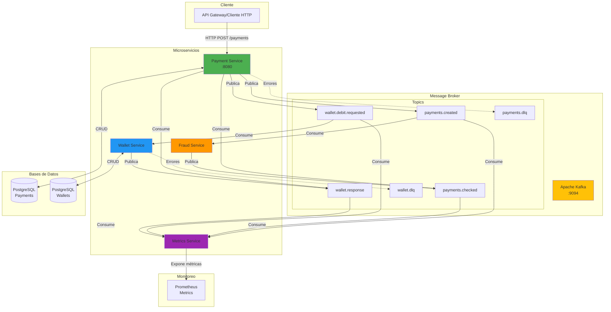
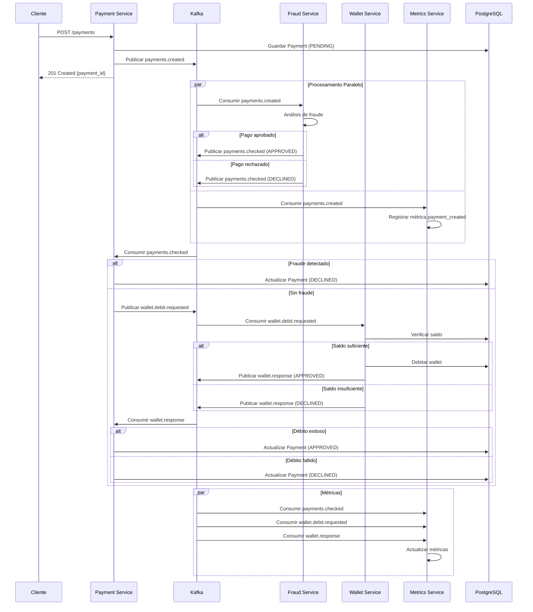
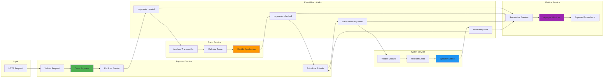
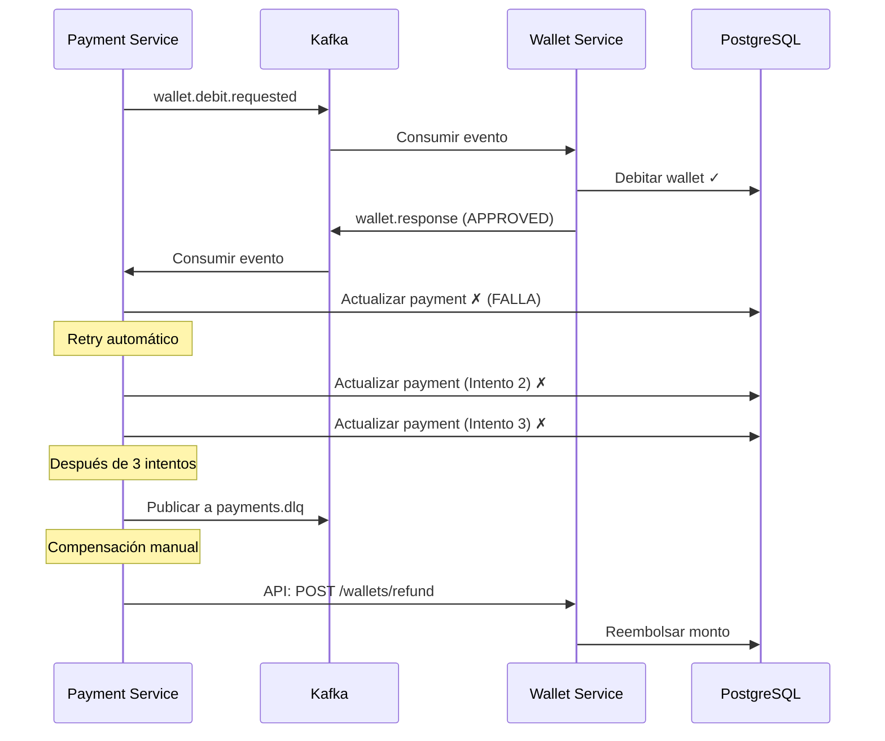
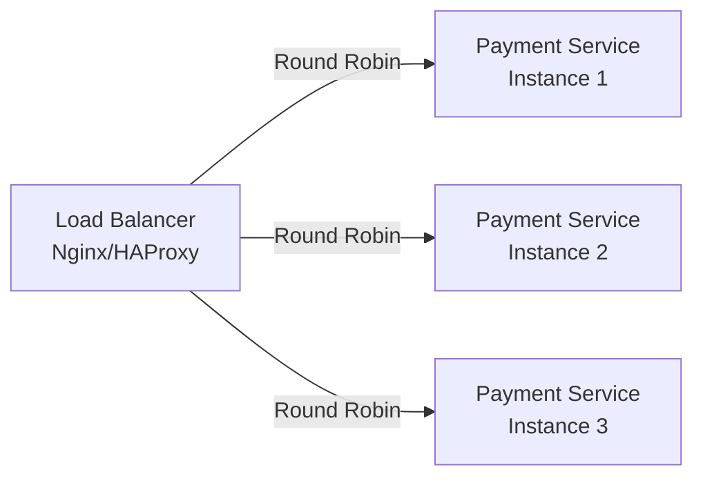
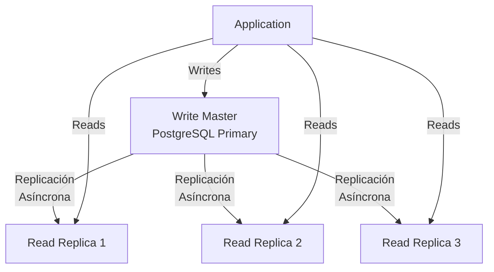
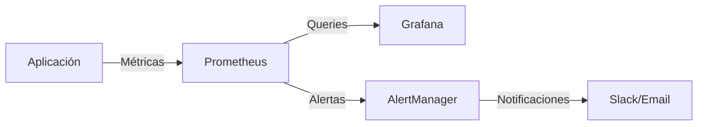

# Draftea - Sistema de Pagos con Arquitectura de Microservicios

Sistema distribuido de procesamiento de pagos basado en arquitectura de microservicios orientada a eventos, implementado con Go, Kafka y PostgreSQL.

## 📋 Tabla de Contenidos

- [Arquitectura del Sistema](#arquitectura-del-sistema)
- [Servicios](#servicios)
- [Arquitectura Orientada a Eventos](#arquitectura-orientada-a-eventos)
- [Stack Tecnológico](#stack-tecnológico)
- [Estrategia de Manejo de Errores](#estrategia-de-manejo-de-errores)
- [Plan de Escalabilidad](#plan-de-escalabilidad)
- [Instalación y Configuración](#instalación-y-configuración)

---

## 🏗️ Arquitectura del Sistema

### Diagrama de Arquitectura de Alto Nivel



### Flujo de Procesamiento de Pagos



### Diagrama de Flujo de Datos



---

## 🔧 Servicios

### 1. Payment Service

**Puerto:** 8080  
**Responsabilidades:**
- Gestionar el ciclo de vida completo de los pagos
- Orquestar el flujo de validación de fraude y débito de wallet
- Exponer API REST para creación de pagos
- Mantener el estado de las transacciones

**Límites del Servicio:**
- ✅ Crear y almacenar pagos
- ✅ Coordinar validaciones asíncronas
- ✅ Actualizar estados basándose en eventos
- ❌ NO realiza validación de fraude (delegado a Fraud Service)
- ❌ NO gestiona saldos de wallets (delegado a Wallet Service)

**Endpoints:**
```
POST   /payments          - Crear nuevo pago
GET    /payments/:id      - Obtener detalles de pago
GET    /health            - Health check
```

**Eventos Publicados:**
- `payments.created` - Cuando se crea un nuevo pago
- `wallet.debit.requested` - Solicita débito al wallet después de pasar validación de fraude

**Eventos Consumidos:**
- `payments.checked` - Resultado de validación de fraude
- `wallet.response` - Resultado de operación de débito

**Base de Datos:** PostgreSQL (payments)
- Tabla: `payments` (id, amount, currency, status, method, customer_id, trace_id, created_at, updated_at)

---

### 2. Fraud Service

**Responsabilidades:**
- Analizar transacciones en tiempo real
- Detectar patrones sospechosos
- Aprobar o rechazar pagos basándose en reglas de negocio

**Límites del Servicio:**
- ✅ Análisis de riesgo de transacciones
- ✅ Aplicación de reglas de fraude
- ✅ Generación de scores de confianza
- ❌ NO modifica el estado del pago directamente
- ❌ NO almacena información de pagos

**Eventos Publicados:**
- `payments.checked` - Resultado del análisis (APPROVED/DECLINED)

**Eventos Consumidos:**
- `payments.created` - Nuevos pagos para analizar

**Base de Datos:** Sin persistencia (stateless)

---

### 3. Wallet Service

**Responsabilidades:**
- Gestionar saldos de usuarios
- Procesar débitos y créditos
- Validar disponibilidad de fondos

**Límites del Servicio:**
- ✅ CRUD de wallets
- ✅ Operaciones de débito/crédito
- ✅ Validación de saldos
- ✅ Mantenimiento de historial de transacciones
- ❌ NO decide si un pago es válido (solo verifica fondos)
- ❌ NO conoce el contexto completo del pago

**Eventos Publicados:**
- `wallet.response` - Resultado de operación de débito (APPROVED/DECLINED)

**Eventos Consumidos:**
- `wallet.debit.requested` - Solicitudes de débito

**Base de Datos:** PostgreSQL (wallet)
- Tabla: `wallets` (id, user_id, balance, currency, created_at, updated_at)

---

### 4. Metrics Service

**Responsabilidades:**
- Recolectar eventos de todos los servicios
- Agregar métricas de negocio
- Exponer métricas para Prometheus

**Límites del Servicio:**
- ✅ Consumir todos los eventos del sistema
- ✅ Calcular métricas en tiempo real
- ✅ Exponer endpoint de métricas
- ❌ NO modifica datos de otros servicios
- ❌ NO participa en flujos de negocio

**Endpoints:**
```
GET /metrics - Endpoint Prometheus
```

**Eventos Consumidos:**
- `payments.created`
- `payments.checked`
- `wallet.debit.requested`
- `wallet.response`

**Métricas Expuestas:**
```
payment_created_total
payment_approved_total
payment_declined_total
wallet_debit_requested_total
wallet_debit_approved_total
wallet_debit_declined_total
```

**Base de Datos:** Sin persistencia (métricas en memoria)

---

## 📡 Arquitectura Orientada a Eventos

### Catálogo de Eventos

| Evento | Productor | Consumidores | Descripción |
|--------|-----------|--------------|-------------|
| `payments.created` | Payment Service | Fraud Service, Metrics Service | Nuevo pago creado en el sistema |
| `payments.checked` | Fraud Service | Payment Service, Metrics Service | Resultado de validación de fraude |
| `wallet.debit.requested` | Payment Service | Wallet Service, Metrics Service | Solicitud de débito a wallet |
| `wallet.response` | Wallet Service | Payment Service, Metrics Service | Respuesta de operación de wallet |
| `payments.dlq` | Payment Service | - | Mensajes fallidos del payment service |
| `wallet.dlq` | Wallet Service | - | Mensajes fallidos del wallet service |

### Estructura de Eventos

#### payments.created
```json
{
  "id": "uuid",
  "amount": 100.50,
  "currency": "USD",
  "status": "PENDING",
  "method": "credit_card",
  "customer_id": "customer-uuid",
  "trace_id": "trace-uuid",
  "created_at": "2024-01-01T12:00:00Z"
}
```

#### payments.checked
```json
{
  "id": "payment-uuid",
  "trace_id": "trace-uuid",
  "status": "APPROVED|DECLINED",
  "reason": "fraud_detected|approved",
  "checked_at": "2024-01-01T12:00:01Z"
}
```

#### wallet.debit.requested
```json
{
  "payment_id": "payment-uuid",
  "user_id": "user-uuid",
  "amount": 100.50,
  "reason": "payment_processing",
  "trace_id": "trace-uuid"
}
```

#### wallet.response
```json
{
  "payment_id": "payment-uuid",
  "user_id": "user-uuid",
  "status": "APPROVED|DECLINED",
  "amount": 100.50,
  "reason": "insufficient_funds|success"
}
```

### Convenciones de Nombres

**Topics:**
- Formato: `{dominio}.{acción}[.{estado}]`
- Ejemplos: `payments.created`, `wallet.response`, `payments.dlq`

**Consumer Groups:**
- Formato: `{servicio}-{topic}-consumer`
- Ejemplos: `fraud-service-payments-created-consumer`

### Garantías de Entrega

- **At-least-once delivery:** Los mensajes se entregan al menos una vez
- **Idempotencia:** Todos los consumidores implementan procesamiento idempotente
- **Orden:** Garantizado por partición (usando payment_id como key)
- **Retry:** 3 intentos con backoff exponencial antes de DLQ

### Patrón Saga - Flujo de Pago

El sistema implementa un **patrón Saga coreografiado** para el procesamiento de pagos:

```mermaid
stateDiagram-v2
    [*] --> PaymentCreated: POST /payments
    PaymentCreated --> FraudCheck: payments.created
    
    FraudCheck --> FraudApproved: Sin fraude
    FraudCheck --> FraudDeclined: Fraude detectado
    
    FraudApproved --> WalletDebit: wallet.debit.requested
    FraudDeclined --> PaymentDeclined: payments.checked
    
    WalletDebit --> WalletApproved: Saldo suficiente
    WalletDebit --> WalletDeclined: Saldo insuficiente
    
    WalletApproved --> PaymentApproved: wallet.response
    WalletDeclined --> PaymentDeclined: wallet.response
    
    PaymentApproved --> [*]
    PaymentDeclined --> [*]
    
    note right of FraudDeclined: Transacción compensatoria:<br/>No se requiere rollback<br/>ya que no hubo débito
    
    note right of WalletDeclined: Transacción compensatoria:<br/>Payment actualizado a DECLINED<br/>No se requiere reembolso
```

**Transacciones Compensatorias:**
- Si el fraude es detectado: El pago se marca como DECLINED, no se requiere compensación
- Si el wallet no tiene fondos: El pago se marca como DECLINED, no se requiere reembolso
- No hay operaciones que requieran rollback complejo debido al diseño del flujo

---

## 🛠️ Stack Tecnológico

### Lenguaje de Programación

**Go 1.25.3**

**Justificación:**
- ✅ Excelente rendimiento y bajo uso de memoria
- ✅ Concurrencia nativa con goroutines (ideal para procesamiento de eventos)
- ✅ Compilación estática (facilita despliegue en contenedores)
- ✅ Ecosistema maduro para microservicios
- ✅ Fuerte tipado y manejo de errores explícito

### Message Broker

**Apache Kafka 7.5.0**

**Justificación:**
- ✅ Alto throughput (millones de mensajes/segundo)
- ✅ Persistencia durable de eventos
- ✅ Escalabilidad horizontal mediante particiones
- ✅ Garantías de orden por partición
- ✅ Replay de eventos (útil para debugging y reprocessing)
- ✅ Ecosistema maduro con herramientas de monitoreo

**Alternativas consideradas:**
- ❌ RabbitMQ: Menor throughput, no diseñado para event sourcing
- ❌ AWS SQS: Vendor lock-in, sin garantías de orden estricto
- ❌ Redis Streams: Menos maduro, limitaciones en persistencia

### Base de Datos

**PostgreSQL 15**

**Justificación:**
- ✅ ACID compliant (crítico para transacciones financieras)
- ✅ Excelente rendimiento para operaciones transaccionales
- ✅ Soporte para JSON (flexibilidad en esquemas)
- ✅ Replicación y alta disponibilidad nativas
- ✅ Amplia adopción y comunidad

**Uso por Servicio:**
- **Payment Service:** Almacenamiento de pagos y estados
- **Wallet Service:** Gestión de saldos y transacciones

**Alternativas consideradas:**
- ❌ MongoDB: Falta de transacciones ACID robustas
- ❌ MySQL: Menor rendimiento en operaciones concurrentes complejas

### Monitoreo y Observabilidad

**Prometheus**

**Justificación:**
- ✅ Estándar de facto para métricas en microservicios
- ✅ Modelo pull (no requiere instrumentación compleja)
- ✅ PromQL para queries flexibles
- ✅ Integración nativa con Grafana

### Frameworks y Librerías

| Componente | Tecnología | Propósito |
|------------|------------|-----------|
| HTTP Framework | Gin | Router HTTP de alto rendimiento |
| ORM | GORM | Abstracción de base de datos |
| Kafka Client | segmentio/kafka-go | Cliente Kafka nativo en Go |
| Logging | Logrus | Logging estructurado |
| Config | godotenv + caarlos0/env | Gestión de configuración |
| UUID | google/uuid | Generación de IDs únicos |

### Containerización y Orquestación

**Docker + Docker Compose**

**Justificación:**
- ✅ Entornos reproducibles
- ✅ Aislamiento de servicios
- ✅ Fácil despliegue local y en producción
- ✅ Networking entre contenedores simplificado

---

## 🚨 Estrategia de Manejo de Errores

### Escenarios de Falla Identificados

| Escenario | Probabilidad | Impacto | Estrategia |
|-----------|--------------|---------|------------|
| Kafka no disponible | Media | Alto | Circuit Breaker + Retry |
| PostgreSQL no disponible | Baja | Crítico | Retry + Alertas |
| Mensaje duplicado | Alta | Bajo | Procesamiento idempotente |
| Mensaje malformado | Media | Medio | Validación + DLQ |
| Timeout en procesamiento | Media | Medio | Timeout + Retry |
| Partición de red | Baja | Alto | Health checks + Failover |

### Políticas de Retry

**Backoff Exponencial:**
```
Intento 1: Inmediato
Intento 2: 2 segundos
Intento 3: 4 segundos
Intento 4: 8 segundos
Después de 4 intentos → DLQ
```

**Implementación en Kafka Consumer:**
```go
retryConfig := RetryConfig{
    MaxRetries:      3,
    InitialInterval: 2 * time.Second,
    MaxInterval:     30 * time.Second,
    Multiplier:      2.0,
}
```

### Dead Letter Queue (DLQ)

**Topics DLQ:**
- `payments.dlq` - Mensajes fallidos del Payment Service
- `wallet.dlq` - Mensajes fallidos del Wallet Service

**Estructura de mensaje DLQ:**
```json
{
  "original_topic": "payments.created",
  "key": "payment-uuid",
  "value": "{...mensaje original...}",
  "timestamp": "2024-01-01T12:00:00Z",
  "attempts": 4,
  "error": "database connection timeout"
}
```

**Proceso de recuperación:**
1. Monitoreo de DLQ mediante alertas
2. Análisis manual de causa raíz
3. Corrección del problema
4. Replay manual desde DLQ al topic original

### Transacciones Compensatorias

**Escenario: Débito exitoso pero falla actualización de pago**



### Circuit Breaker

**Implementación para conexiones externas:**

```go
type CircuitBreaker struct {
    MaxFailures    int           // 5 fallos
    Timeout        time.Duration // 30 segundos
    ResetTimeout   time.Duration // 60 segundos
}
```

**Estados:**
- **Closed:** Operación normal
- **Open:** Rechaza requests inmediatamente (después de 5 fallos)
- **Half-Open:** Permite 1 request de prueba después de 60s

**Aplicado a:**
- Conexiones a Kafka
- Conexiones a PostgreSQL
- Llamadas entre servicios (si se implementan)

### Health Checks

**Endpoint:** `GET /health`

**Respuesta:**
```json
{
  "status": "healthy|degraded|unhealthy",
  "timestamp": "2024-01-01T12:00:00Z",
  "checks": {
    "database": "healthy",
    "kafka": "healthy"
  }
}
```

**Criterios:**
- `healthy`: Todos los componentes operativos
- `degraded`: Componente no crítico fallando (ej: métricas)
- `unhealthy`: Componente crítico fallando (ej: database)

### Logging y Trazabilidad

**Trace ID:**
- Generado en Payment Service al crear el pago
- Propagado en todos los eventos
- Permite rastrear flujo completo end-to-end

**Niveles de Log:**
- `ERROR`: Fallos que requieren intervención
- `WARN`: Situaciones anómalas pero recuperables
- `INFO`: Eventos de negocio importantes
- `DEBUG`: Información detallada para debugging

**Formato estructurado (JSON):**
```json
{
  "level": "error",
  "trace_id": "trace-uuid",
  "service": "payment-service",
  "message": "Failed to update payment status",
  "error": "connection timeout",
  "timestamp": "2024-01-01T12:00:00Z"
}
```

---

## 📈 Plan de Escalabilidad

### Estrategias de Escalamiento Horizontal

#### 1. Servicios Stateless

**Todos los servicios son stateless**, permitiendo escalamiento horizontal sin coordinación:

```yaml
# Ejemplo: Escalar Payment Service
docker-compose up --scale payment-service=3
```

**Beneficios:**
- ✅ Agregar/remover instancias sin downtime
- ✅ Load balancing automático
- ✅ Tolerancia a fallos (si una instancia falla, otras continúan)

#### 2. Particionamiento de Kafka

**Estrategia de particiones:**

```
payments.created:      6 particiones
payments.checked:      6 particiones
wallet.debit.requested: 6 particiones
wallet.response:       6 particiones
```

**Key de partición:** `payment_id` (garantiza orden para mismo pago)

**Escalamiento:**
- 1-2 instancias → 2 particiones
- 3-4 instancias → 4 particiones
- 5-6 instancias → 6 particiones
- 7+ instancias → 8+ particiones

#### 3. Consumer Groups

**Configuración:**
```go
ConsumerGroup: "payment-service-fraud-consumer"
Partitions:    6
Instances:     3 (cada instancia consume 2 particiones)
```

**Escalamiento dinámico:**
- Kafka rebalancea automáticamente al agregar/remover consumidores
- Máximo de consumidores = número de particiones

### Balanceo de Carga

#### Nivel de Aplicación



**Algoritmo:** Round Robin con health checks

**Configuración Nginx:**
```nginx
upstream payment_service {
    least_conn;
    server payment-service-1:8080 max_fails=3 fail_timeout=30s;
    server payment-service-2:8080 max_fails=3 fail_timeout=30s;
    server payment-service-3:8080 max_fails=3 fail_timeout=30s;
}
```

#### Nivel de Kafka

- **Balanceo automático** mediante consumer groups
- **Sticky partitioning** para mantener afinidad de caché

### Particionamiento de Base de Datos

#### Sharding por Customer ID

**Estrategia:** Horizontal sharding basado en `customer_id`

```
Shard 1: customer_id hash % 4 == 0
Shard 2: customer_id hash % 4 == 1
Shard 3: customer_id hash % 4 == 2
Shard 4: customer_id hash % 4 == 3
```

**Implementación:**
```go
func GetShardID(customerID string) int {
    hash := crc32.ChecksumIEEE([]byte(customerID))
    return int(hash % 4)
}
```

#### Read Replicas



**Configuración:**
- Writes → Master
- Reads → Replicas (round robin)
- Replicación asíncrona (eventual consistency aceptable para queries)

### Estrategias de Caché

#### 1. Caché de Aplicación (In-Memory)

**Wallet Balance Cache:**
```go
type WalletCache struct {
    cache map[string]WalletBalance
    ttl   time.Duration // 30 segundos
    mu    sync.RWMutex
}
```

**Invalidación:**
- TTL de 30 segundos
- Invalidación explícita después de débito/crédito

#### 2. Redis (Opcional para producción)

**Casos de uso:**
- Caché de saldos de wallet (lectura frecuente)
- Rate limiting por customer
- Session storage

**Configuración:**
```yaml
redis:
  mode: cluster
  nodes: 3
  replication_factor: 2
  eviction_policy: allkeys-lru
```

### Análisis de Cuellos de Botella

#### Métricas Clave

| Métrica | Threshold | Acción |
|---------|-----------|--------|
| Kafka Consumer Lag | > 1000 mensajes | Escalar consumidores |
| Database Connection Pool | > 80% utilización | Aumentar pool size o escalar DB |
| CPU Usage | > 70% | Escalar instancias |
| Memory Usage | > 80% | Optimizar código o escalar |
| HTTP Response Time p95 | > 500ms | Investigar y optimizar |

#### Herramientas de Monitoreo



**Dashboards Grafana:**
1. **Service Health:** CPU, Memory, Request Rate, Error Rate
2. **Kafka Metrics:** Consumer lag, Throughput, Partition distribution
3. **Database Metrics:** Connections, Query time, Slow queries
4. **Business Metrics:** Payments created, Approval rate, Fraud detection rate

#### Proyecciones de Capacidad

**Escenario Base:**
- 1,000 pagos/minuto
- 1 instancia de cada servicio
- 2 particiones por topic

**Escenario Medio (10x):**
- 10,000 pagos/minuto
- 3 instancias de cada servicio
- 6 particiones por topic
- 2 read replicas

**Escenario Alto (100x):**
- 100,000 pagos/minuto
- 10 instancias de cada servicio
- 12 particiones por topic
- 5 read replicas
- Database sharding (4 shards)
- Redis cluster para caché

### Auto-Scaling (Kubernetes)

**Horizontal Pod Autoscaler (HPA):**

```yaml
apiVersion: autoscaling/v2
kind: HorizontalPodAutoscaler
metadata:
  name: payment-service-hpa
spec:
  scaleTargetRef:
    apiVersion: apps/v1
    kind: Deployment
    name: payment-service
  minReplicas: 2
  maxReplicas: 10
  metrics:
  - type: Resource
    resource:
      name: cpu
      target:
        type: Utilization
        averageUtilization: 70
  - type: Resource
    resource:
      name: memory
      target:
        type: Utilization
        averageUtilization: 80
```

---

## 🚀 Instalación y Configuración

### Prerrequisitos

- Docker 20.10+
- Docker Compose 2.0+
- Go 1.25+ (para desarrollo local)

### Instalación Rápida

```bash
# Clonar el repositorio
git clone https://github.com/jeffleon2/draftea.git
cd draftea

# Levantar todos los servicios
docker-compose -f payment-service/docker-compose.yml up -d
docker-compose -f wallet-service/docker-compose.yml up -d
docker-compose -f fraud-service/docker-compose.yml up -d
docker-compose -f metrics-service/docker-compose.yml up -d

# Verificar que todos los servicios estén corriendo
docker ps
```

### Variables de Entorno

Cada servicio tiene un archivo `.env-example`. Copiar y configurar:

```bash
# Payment Service
cd payment-service
cp .env-example .env
# Editar .env según necesidades

# Repetir para cada servicio
```

### Verificación

```bash
# Health check de Payment Service
curl http://localhost:8080/health

# Métricas de Metrics Service
curl http://localhost:9090/metrics

# Crear un pago de prueba
curl -X POST http://localhost:8080/payments \
  -H "Content-Type: application/json" \
  -d '{
    "amount": 100.50,
    "currency": "USD",
    "method": "credit_card",
    "customer_id": "customer-123"
  }'
```

### Acceso a Herramientas

- **Adminer (DB UI):** http://localhost:8081
- **Prometheus:** http://localhost:9090 (si configurado)
- **Kafka UI:** Configurar Kafka UI separadamente

---

## 📚 Documentación Adicional

- [API Documentation](./docs/api.md) *(pendiente)*
- [Development Guide](./docs/development.md) *(pendiente)*
- [Deployment Guide](./docs/deployment.md) *(pendiente)*
- [Troubleshooting](./docs/troubleshooting.md) *(pendiente)*

---

## 📄 Licencia

Este proyecto es privado y confidencial.

---

## 👥 Contribuidores

- **Jeff Leon** - Arquitectura y desarrollo inicial

---

**Última actualización:** Diciembre 2024
